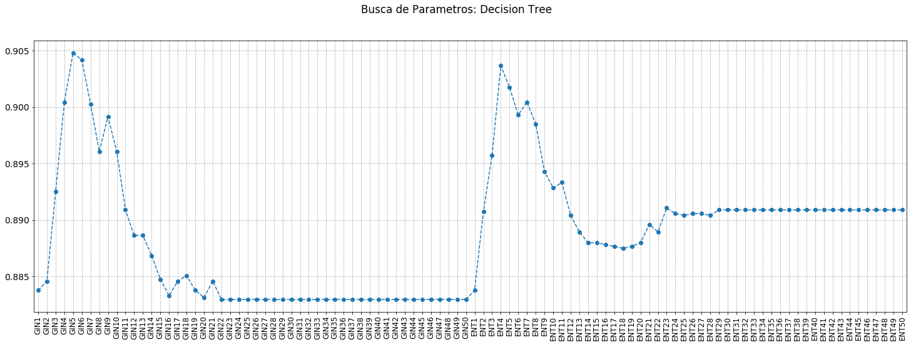
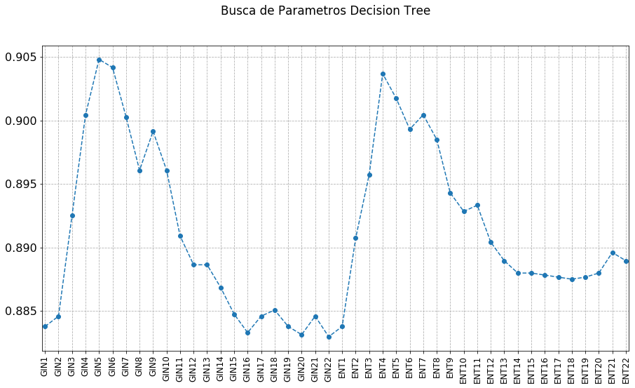
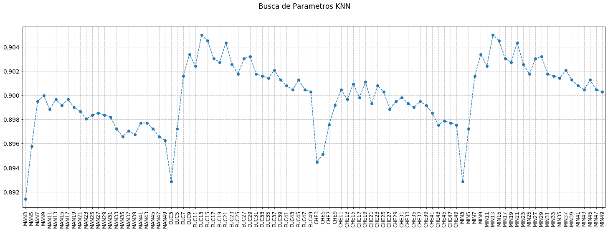
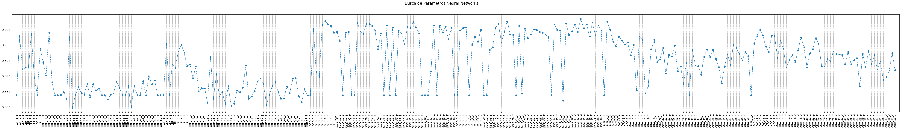
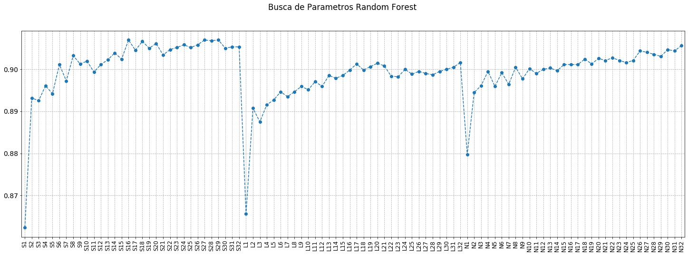
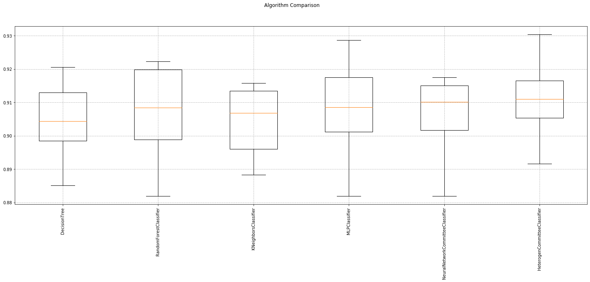

## Projeto de Mineração de Dados: Bank Marketing Data Set

### Relatório 5: Algoritmos e Desempenhos dos Classificadores

#### Equipe
* Antonio Augusto Correa Gondim Neto (aacgn)
* Eduardo Santos de Moura (esm7)
* Marcos Vinicius Holanda Borges (mvhb)
* Vinícius Giles Costa Paulino (vgcp)

### Árvore de Decisão
Foi utilizado o **DecisionTreeClassifier** para criação do modelo, que é uma classe capaz de executar a classificação multi-classe em um conjunto de dados. De modo a criar configurações diferentes para tentar extrair o melhor resultado possível, foram feitas variações dos parâmetros *criterion* e *max_depth*. Além disso, o parâmetro *random_state* (`42`) também foi utilizado.

No *criterion*, foram utilizados dois valores: *gini* e *entropy*. O primeiro diz respeito a impureza de Gini, enquanto o segundo para o ganho de informações. Além disso, Gini é mais utilizado para minimizar erros de classificação e a *entropy* é mais voltado para análise exploratória. No parâmetro *max_depth*, aplicamos um range de valores de 1 a 50 a fim de obter uma variedade maior na busca pela melhor configuração. 

Dessa forma, obtivemos 100 diferentes configurações de parâmetros, as quais foram submetidas a validação cruzada utilizando o `StratifiedKFold` com `k` = 10 em 20% do conjunto de treinamento. A média dos valores obtidos com o `KFold` foi calculada e guardada para posterior análise.

#### Resultados
Na tabela abaixo pode-se verificar detalhadamente todas as configurações com seus parâmetros e a acurácia média:

Configuração | *criterion* | *max_depth* | Acurácia média
------ | ------- | -------- | ----------
GIN1 | gini | 1 | 0.8838
GIN2 | gini | 2 | 0.8846
GIN3 | gini | 3 | 0.8925
GIN4 | gini | 4 | 0.9005
GIN5 | gini | 5 | 0.9048
GIN6 | gini | 6 | 0.9042
GIN7 | gini | 7 | 0.9003
GIN8 | gini | 8 | 0.8961
GIN9 | gini | 9 | 0.8992
GIN10 | gini | 10 | 0.8961
GIN11 | gini | 11 | 0.8909
GIN12 | gini | 12 | 0.8886
GIN13 | gini | 13 | 0.8886
GIN14 | gini | 14 | 0.8869
GIN15 | gini | 15 | 0.8848
GIN16 | gini | 16 | 0.8833
GIN17 | gini | 17 | 0.8846
GIN18 | gini | 18 | 0.8851
GIN19 | gini | 19 | 0.8838
GIN20 | gini | 20 | 0.8831
GIN21 | gini | 21 | 0.8846
GIN22 | gini | 22 | 0.8830
GIN23 | gini | 23 | 0.8830
GIN24 | gini | 24 | 0.8830
GIN25 | gini | 25 | 0.8830
GIN26 | gini | 26 | 0.8830
GIN27 | gini | 27 | 0.8830
GIN28 | gini | 28 | 0.8830
GIN29 | gini | 29 | 0.8830
GIN30 | gini | 30 | 0.8830
GIN31 | gini | 31 | 0.8830
GIN32 | gini | 32 | 0.8830
GIN33 | gini | 33 | 0.8830
GIN34 | gini | 34 | 0.8830
GIN35 | gini | 35 | 0.8830
GIN36 | gini | 36 | 0.8830
GIN37 | gini | 37 | 0.8830
GIN38 | gini | 38 | 0.8830
GIN39 | gini | 39 | 0.8830
GIN40 | gini | 40 | 0.8830
GIN41 | gini | 41 | 0.8830
GIN42 | gini | 42 | 0.8830
GIN43 | gini | 43 | 0.8830
GIN44 | gini | 44 | 0.8830
GIN45 | gini | 45 | 0.8830
GIN46 | gini | 46 | 0.8830
GIN47 | gini | 47 | 0.8830
GIN48 | gini | 48 | 0.8830
GIN49 | gini | 49 | 0.8830
GIN50 | gini | 50 | 0.8830
ENT1 | entropy | 1 | 0.8838
ENT2 | entropy | 2 | 0.8907
ENT3 | entropy | 3 | 0.8958
ENT4 | entropy | 4 | 0.9037
ENT5 | entropy | 5 | 0.9018
ENT6 | entropy | 6 | 0.8993
ENT7 | entropy | 7 | 0.9005
ENT8 | entropy | 8 | 0.8985
ENT9 | entropy | 9 | 0.8943
ENT10 | entropy | 10 | 0.8928
ENT11 | entropy | 11 | 0.8933
ENT12 | entropy | 12 | 0.8904
ENT13 | entropy | 13 | 0.8890
ENT14 | entropy | 14 | 0.8880
ENT15 | entropy | 15 | 0.8880
ENT16 | entropy | 16 | 0.8878
ENT17 | entropy | 17 | 0.8877
ENT18 | entropy | 18 | 0.8875
ENT19 | entropy | 19 | 0.8877
ENT20 | entropy | 20 | 0.8880
ENT21 | entropy | 21 | 0.8896
ENT22 | entropy | 22 | 0.8890
ENT23 | entropy | 23 | 0.8911
ENT24 | entropy | 24 | 0.8906
ENT25 | entropy | 25 | 0.8904
ENT26 | entropy | 26 | 0.8906
ENT27 | entropy | 27 | 0.8906
ENT28 | entropy | 28 | 0.8904
ENT29 | entropy | 29 | 0.8909
ENT30 | entropy | 30 | 0.8909
ENT31 | entropy | 31 | 0.8909
ENT32 | entropy | 32 | 0.8909
ENT33 | entropy | 33 | 0.8909
ENT34 | entropy | 34 | 0.8909
ENT35 | entropy | 35 | 0.8909
ENT36 | entropy | 36 | 0.8909
ENT37 | entropy | 37 | 0.8909
ENT38 | entropy | 38 | 0.8909
ENT39 | entropy | 39 | 0.8909
ENT40 | entropy | 40 | 0.8909
ENT41 | entropy | 41 | 0.8909
ENT42 | entropy | 42 | 0.8909
ENT43 | entropy | 43 | 0.8909
ENT44 | entropy | 44 | 0.8909
ENT45 | entropy | 45 | 0.8909
ENT46 | entropy | 46 | 0.8909
ENT47 | entropy | 47 | 0.8909
ENT48 | entropy | 48 | 0.8909
ENT49 | entropy | 49 | 0.8909
ENT50 | entropy | 50 | 0.8909

A partir dessas informações foi plotado o gráfico abaixo:


Nele é mais fácil perceber que com o valor de *max_depth* maior que 22 não ocorre nenhuma melhora significativa na performance da árvore, e a acurácia permanece quase constante. Com isso, ignorando GIN23 a GIN50 e ENT23 a ENT50 podemos plotar um gráfico com menos pontos e mais simples:



A melhor configuração encontrada a partir da experimentação foi a **GIN5**, conseguindo uma acurácia média de **0.9048** com os seguintes parâmetros:

```
GIN5 => { 'criterion': 'gini', 'max_depth': 5 }
``` 

### KNN: K-Vizinhos Mais Próximos

No algoritmo `KNN` (*k-nearest neighbors*), os parâmetros necessários são *metric* e *n_neighbors*. O *metric* serve define a métrica de distância que será utilizada para comparar a distância entre dois pontos, podendo assumir os seguintes valores: [*manhattan*, *euclidean*, *chebyshev*, *minkowski*]. Já o *n_neighbors* representa o **k**, ou seja, a quantidade de vizinhos mais próximos para se fazer a classificação. Em todas as variações dos parâmetros foram utilizados valores ímpares para essa parâmetro, pois, caso fosse par, existe uma possibilidade de empate entre duas classes.

Obtivemos 96 diferentes configurações de parâmetros, as quais foram submetidas a validação cruzada utilizando o `StratifiedKFold` com `k` = 10 em 20% do conjunto de treinamento. Para o parâmetro *n_neighbors*, aplicamos um range de valores ímpares entre 3 e 50 para cada *metric* a fim de obter uma variedade maior na busca pela melhor configuração. A média dos valores obtidos com o `KFold` foi calculada e guardada para posterior análise.

#### Resultados
Na tabela abaixo encontram-se todas as configurações detalhadas, com seus parâmetros e a acurácia média:

Configuração | *metric* | *n_neighbors* | Acurácia média
------ | ------- | -------- | ----------
MAN3 | manhattan | 3 | 0.8914
MAN5 | manhattan | 5 | 0.8958
MAN7 | manhattan | 7 | 0.8995
MAN9 | manhattan | 9 | 0.9000
MAN11 | manhattan | 11 | 0.8988
MAN13 | manhattan | 13 | 0.8996
MAN15 | manhattan | 15 | 0.8992
MAN17 | manhattan | 17 | 0.8996
MAN19 | manhattan | 19 | 0.8990
MAN21 | manhattan | 21 | 0.8987
MAN23 | manhattan | 23 | 0.8980
MAN25 | manhattan | 25 | 0.8984
MAN27 | manhattan | 27 | 0.8985
MAN29 | manhattan | 29 | 0.8984
MAN31 | manhattan | 31 | 0.8982
MAN33 | manhattan | 33 | 0.8972
MAN35 | manhattan | 35 | 0.8966
MAN37 | manhattan | 37 | 0.8971
MAN39 | manhattan | 39 | 0.8967
MAN41 | manhattan | 41 | 0.8977
MAN43 | manhattan | 43 | 0.8977
MAN45 | manhattan | 45 | 0.8972
MAN47 | manhattan | 47 | 0.8966
MAN49 | manhattan | 49 | 0.8962
EUC3 | euclidean | 3 | 0.8928
EUC5 | euclidean | 5 | 0.8972
EUC7 | euclidean | 7 | 0.9016
EUC9 | euclidean | 9 | 0.9034
EUC11 | euclidean | 11 | 0.9024
EUC13 | euclidean | 13 | 0.9050
EUC15 | euclidean | 15 | 0.9045
EUC17 | euclidean | 17 | 0.9030
EUC19 | euclidean | 19 | 0.9027
EUC21 | euclidean | 21 | 0.9043
EUC23 | euclidean | 23 | 0.9026
EUC25 | euclidean | 25 | 0.9017
EUC27 | euclidean | 27 | 0.9030
EUC29 | euclidean | 29 | 0.9032
EUC31 | euclidean | 31 | 0.9017
EUC33 | euclidean | 33 | 0.9016
EUC35 | euclidean | 35 | 0.9014
EUC37 | euclidean | 37 | 0.9021
EUC39 | euclidean | 39 | 0.9013
EUC41 | euclidean | 41 | 0.9008
EUC43 | euclidean | 43 | 0.9005
EUC45 | euclidean | 45 | 0.9013
EUC47 | euclidean | 47 | 0.9005
EUC49 | euclidean | 49 | 0.9003
CHE3 | chebyshev | 3 | 0.8945
CHE5 | chebyshev | 5 | 0.8951
CHE7 | chebyshev | 7 | 0.8975
CHE9 | chebyshev | 9 | 0.8992
CHE11 | chebyshev | 11 | 0.9005
CHE13 | chebyshev | 13 | 0.8996
CHE15 | chebyshev | 15 | 0.9009
CHE17 | chebyshev | 17 | 0.8998
CHE19 | chebyshev | 19 | 0.9011
CHE21 | chebyshev | 21 | 0.8993
CHE23 | chebyshev | 23 | 0.9008
CHE25 | chebyshev | 25 | 0.9003
CHE27 | chebyshev | 27 | 0.8988
CHE29 | chebyshev | 29 | 0.8995
CHE31 | chebyshev | 31 | 0.8998
CHE33 | chebyshev | 33 | 0.8993
CHE35 | chebyshev | 35 | 0.8990
CHE37 | chebyshev | 37 | 0.8995
CHE39 | chebyshev | 39 | 0.8992
CHE41 | chebyshev | 41 | 0.8985
CHE43 | chebyshev | 43 | 0.8975
CHE45 | chebyshev | 45 | 0.8979
CHE47 | chebyshev | 47 | 0.8977
CHE49 | chebyshev | 49 | 0.8975
MIN3 | minkowski | 3 | 0.8928
MIN5 | minkowski | 5 | 0.8972
MIN7 | minkowski | 7 | 0.9016
MIN9 | minkowski | 9 | 0.9034
MIN11 | minkowski | 11 | 0.9024
MIN13 | minkowski | 13 | 0.9050
MIN15 | minkowski | 15 | 0.9045
MIN17 | minkowski | 17 | 0.9030
MIN19 | minkowski | 19 | 0.9027
MIN21 | minkowski | 21 | 0.9043
MIN23 | minkowski | 23 | 0.9026
MIN25 | minkowski | 25 | 0.9017
MIN27 | minkowski | 27 | 0.9030
MIN29 | minkowski | 29 | 0.9032
MIN31 | minkowski | 31 | 0.9017
MIN33 | minkowski | 33 | 0.9016
MIN35 | minkowski | 35 | 0.9014
MIN37 | minkowski | 37 | 0.9021
MIN39 | minkowski | 39 | 0.9013
MIN41 | minkowski | 41 | 0.9008
MIN43 | minkowski | 43 | 0.9005
MIN45 | minkowski | 45 | 0.9013
MIN47 | minkowski | 47 | 0.9005
MIN49 | minkowski | 49 | 0.9003

A partir dos dados coletados, foi plotado o gráfico abaixo:


Foi observado que as configurações com o parâmetro *metric* setado como `euclidean` ou `minkowski` tiveram acurácias médias idênticas. As melhores configurações encontradas a partir da experimentação foram **EUC13** e **MIN13**, ambas com uma acurácia média de **0.9050** com os seguintes parâmetros:

```
EUC13 => { 'metric': 'euclidean', 'n_neighbors': 13 }
MIN13 => { 'metric': 'minkowski', 'n_neighbors': 13 }
``` 
Devido ao empate, daqui em diante a configuração **EUC13** foi escolhida para representar a melhor performance do algoritmo KNN.

### Redes Neurais

Para a base de dados em questão, foi utilizado o **MLPClassifier** para construção do modelo. As variações feitas para encontrar o melhor resultado possível foram feitas nos parâmetros *solver* e *hidden_layer_size*. Além disso também foi utilizado o *random_state* (`42`).

Sobre o *hidden_layer_sizes*, ele recebe o i-ésimo elemento que representa o número de neurônios na i-ésima camada oculta. Quanto ao parâmetro ‘solver’, foram utilizadas três tipos diferentes, são eles: {`'lbfgs'`, `'sgd'`, `'adam'`}. `'lbfgs'` é um otimizador na família de métodos quasi-Newton. Já `'sgd'` refere-se à descida do gradiente estocástico e `'adam'` refere-se a um otimizador estocástico baseado em gradiente proposto por Kingma, Diederik e Jimmy Ba. O ‘solver’ padrão, que é `'adam'`, funciona muito bem em conjuntos de dados relativamente grandes (com milhares de amostras de treinamento ou mais) em termos de tempo de treinamento e pontuação de validação. Para conjuntos de dados pequenos, no entanto, o `'lbfgs'` pode convergir mais rapidamente e ter um desempenho melhor.

Obtivemos 300 diferentes configurações de parâmetros para a rede neural, as quais foram submetidas a validação cruzada utilizando o `StratifiedKFold` com `k` = 10 em 20% do conjunto de treinamento. Para o parâmetro *hidden_layer_size*, aplicamos uma combinação de no máximo 2 camadas e no máximo 50 neurônios para cada camada por *solver*, a fim de obter uma variedade maior na busca pela melhor configuração. A média dos valores obtidos com o `KFold` foi calculada e guardada para posterior análise.

#### Resultados

Na tabela abaixo encontram-se todas as configurações detalhadas, com seus parâmetros e a acurácia média:

Variação | *solver* | *hidden_layer_sizes* | Acurácia média
------ | ------- | -------- | ----------
LBF_1_1 | lbfgs | (1, 1) | 0.8838
LBF_2_1 | lbfgs | (2, 1) | 0.9029
LBF_3_1 | lbfgs | (3, 1) | 0.8920
LBF_4_1 | lbfgs | (4, 1) | 0.8927
LBF_5_1 | lbfgs | (5, 1) | 0.8928
LBF_6_1 | lbfgs | (6, 1) | 0.9035
LBF_7_1 | lbfgs | (7, 1) | 0.8894
LBF_8_1 | lbfgs | (8, 1) | 0.8838
LBF_9_1 | lbfgs | (9, 1) | 0.8988
LBF_10_1 | lbfgs | (10, 1) | 0.8945
LBF_11_1 | lbfgs | (11, 1) | 0.8901
LBF_12_1 | lbfgs | (12, 1) | 0.9039
LBF_13_1 | lbfgs | (13, 1) | 0.8880
LBF_14_1 | lbfgs | (14, 1) | 0.8838
LBF_15_1 | lbfgs | (15, 1) | 0.8838
LBF_16_1 | lbfgs | (16, 1) | 0.8838
LBF_17_1 | lbfgs | (17, 1) | 0.8848
LBF_18_1 | lbfgs | (18, 1) | 0.8825
LBF_19_1 | lbfgs | (19, 1) | 0.9026
LBF_20_1 | lbfgs | (20, 1) | 0.8797
LBF_21_1 | lbfgs | (21, 1) | 0.8838
LBF_22_1 | lbfgs | (22, 1) | 0.8864
LBF_23_1 | lbfgs | (23, 1) | 0.8844
LBF_24_1 | lbfgs | (24, 1) | 0.8839
LBF_25_1 | lbfgs | (25, 1) | 0.8875
LBF_26_1 | lbfgs | (26, 1) | 0.8830
LBF_27_1 | lbfgs | (27, 1) | 0.8873
LBF_28_1 | lbfgs | (28, 1) | 0.8852
LBF_29_1 | lbfgs | (29, 1) | 0.8859
LBF_30_1 | lbfgs | (30, 1) | 0.8838
LBF_31_1 | lbfgs | (31, 1) | 0.8838
LBF_32_1 | lbfgs | (32, 1) | 0.8823
LBF_33_1 | lbfgs | (33, 1) | 0.8839
LBF_34_1 | lbfgs | (34, 1) | 0.8843
LBF_35_1 | lbfgs | (35, 1) | 0.8882
LBF_36_1 | lbfgs | (36, 1) | 0.8860
LBF_37_1 | lbfgs | (37, 1) | 0.8838
LBF_38_1 | lbfgs | (38, 1) | 0.8838
LBF_39_1 | lbfgs | (39, 1) | 0.8867
LBF_40_1 | lbfgs | (40, 1) | 0.8799
LBF_41_1 | lbfgs | (41, 1) | 0.8869
LBF_42_1 | lbfgs | (42, 1) | 0.8838
LBF_43_1 | lbfgs | (43, 1) | 0.8838
LBF_44_1 | lbfgs | (44, 1) | 0.8883
LBF_45_1 | lbfgs | (45, 1) | 0.8838
LBF_46_1 | lbfgs | (46, 1) | 0.8899
LBF_47_1 | lbfgs | (47, 1) | 0.8872
LBF_48_1 | lbfgs | (48, 1) | 0.8885
LBF_49_1 | lbfgs | (49, 1) | 0.8838
LBF_50_1 | lbfgs | (50, 1) | 0.8838
LBF_1_2 | lbfgs | (1, 2) | 0.8838
LBF_2_2 | lbfgs | (2, 2) | 0.9003
LBF_3_2 | lbfgs | (3, 2) | 0.8838
LBF_4_2 | lbfgs | (4, 2) | 0.8937
LBF_5_2 | lbfgs | (5, 2) | 0.8925
LBF_6_2 | lbfgs | (6, 2) | 0.8979
LBF_7_2 | lbfgs | (7, 2) | 0.9001
LBF_8_2 | lbfgs | (8, 2) | 0.8975
LBF_9_2 | lbfgs | (9, 2) | 0.8932
LBF_10_2 | lbfgs | (10, 2) | 0.8937
LBF_11_2 | lbfgs | (11, 2) | 0.8893
LBF_12_2 | lbfgs | (12, 2) | 0.8930
LBF_13_2 | lbfgs | (13, 2) | 0.8851
LBF_14_2 | lbfgs | (14, 2) | 0.8860
LBF_15_2 | lbfgs | (15, 2) | 0.8859
LBF_16_2 | lbfgs | (16, 2) | 0.8814
LBF_17_2 | lbfgs | (17, 2) | 0.8961
LBF_18_2 | lbfgs | (18, 2) | 0.8827
LBF_19_2 | lbfgs | (19, 2) | 0.8907
LBF_20_2 | lbfgs | (20, 2) | 0.8835
LBF_21_2 | lbfgs | (21, 2) | 0.8849
LBF_22_2 | lbfgs | (22, 2) | 0.8809
LBF_23_2 | lbfgs | (23, 2) | 0.8867
LBF_24_2 | lbfgs | (24, 2) | 0.8804
LBF_25_2 | lbfgs | (25, 2) | 0.8810
LBF_26_2 | lbfgs | (26, 2) | 0.8852
LBF_27_2 | lbfgs | (27, 2) | 0.8848
LBF_28_2 | lbfgs | (28, 2) | 0.8862
LBF_29_2 | lbfgs | (29, 2) | 0.8933
LBF_30_2 | lbfgs | (30, 2) | 0.8826
LBF_31_2 | lbfgs | (31, 2) | 0.8835
LBF_32_2 | lbfgs | (32, 2) | 0.8851
LBF_33_2 | lbfgs | (33, 2) | 0.8882
LBF_34_2 | lbfgs | (34, 2) | 0.8891
LBF_35_2 | lbfgs | (35, 2) | 0.8873
LBF_36_2 | lbfgs | (36, 2) | 0.8807
LBF_37_2 | lbfgs | (37, 2) | 0.8838
LBF_38_2 | lbfgs | (38, 2) | 0.8867
LBF_39_2 | lbfgs | (39, 2) | 0.8880
LBF_40_2 | lbfgs | (40, 2) | 0.8848
LBF_41_2 | lbfgs | (41, 2) | 0.8826
LBF_42_2 | lbfgs | (42, 2) | 0.8828
LBF_43_2 | lbfgs | (43, 2) | 0.8865
LBF_44_2 | lbfgs | (44, 2) | 0.8844
LBF_45_2 | lbfgs | (45, 2) | 0.8891
LBF_46_2 | lbfgs | (46, 2) | 0.8893
LBF_47_2 | lbfgs | (47, 2) | 0.8835
LBF_48_2 | lbfgs | (48, 2) | 0.8815
LBF_49_2 | lbfgs | (49, 2) | 0.8857
LBF_50_2 | lbfgs | (50, 2) | 0.8836
SGD_1_1 | sgd | (1, 1) | 0.8838
SGD_2_1 | sgd | (2, 1) | 0.9051
SGD_3_1 | sgd | (3, 1) | 0.8912
SGD_4_1 | sgd | (4, 1) | 0.8896
SGD_5_1 | sgd | (5, 1) | 0.9064
SGD_6_1 | sgd | (6, 1) | 0.9077
SGD_7_1 | sgd | (7, 1) | 0.9066
SGD_8_1 | sgd | (8, 1) | 0.9061
SGD_9_1 | sgd | (9, 1) | 0.9039
SGD_10_1 | sgd | (10, 1) | 0.9042
SGD_11_1 | sgd | (11, 1) | 0.9013
SGD_12_1 | sgd | (12, 1) | 0.8838
SGD_13_1 | sgd | (13, 1) | 0.9040
SGD_14_1 | sgd | (14, 1) | 0.9042
SGD_15_1 | sgd | (15, 1) | 0.8838
SGD_16_1 | sgd | (16, 1) | 0.8838
SGD_17_1 | sgd | (17, 1) | 0.9071
SGD_18_1 | sgd | (18, 1) | 0.9043
SGD_19_1 | sgd | (19, 1) | 0.9035
SGD_20_1 | sgd | (20, 1) | 0.9068
SGD_21_1 | sgd | (21, 1) | 0.9068
SGD_22_1 | sgd | (22, 1) | 0.9061
SGD_23_1 | sgd | (23, 1) | 0.9045
SGD_24_1 | sgd | (24, 1) | 0.8987
SGD_25_1 | sgd | (25, 1) | 0.9037
SGD_26_1 | sgd | (26, 1) | 0.8838
SGD_27_1 | sgd | (27, 1) | 0.9063
SGD_28_1 | sgd | (28, 1) | 0.8838
SGD_29_1 | sgd | (29, 1) | 0.9056
SGD_30_1 | sgd | (30, 1) | 0.8838
SGD_31_1 | sgd | (31, 1) | 0.9045
SGD_32_1 | sgd | (32, 1) | 0.9037
SGD_33_1 | sgd | (33, 1) | 0.9001
SGD_34_1 | sgd | (34, 1) | 0.9058
SGD_35_1 | sgd | (35, 1) | 0.9055
SGD_36_1 | sgd | (36, 1) | 0.9074
SGD_37_1 | sgd | (37, 1) | 0.9056
SGD_38_1 | sgd | (38, 1) | 0.9037
SGD_39_1 | sgd | (39, 1) | 0.8838
SGD_40_1 | sgd | (40, 1) | 0.8838
SGD_41_1 | sgd | (41, 1) | 0.8838
SGD_42_1 | sgd | (42, 1) | 0.8914
SGD_43_1 | sgd | (43, 1) | 0.9063
SGD_44_1 | sgd | (44, 1) | 0.8838
SGD_45_1 | sgd | (45, 1) | 0.9063
SGD_46_1 | sgd | (46, 1) | 0.9040
SGD_47_1 | sgd | (47, 1) | 0.9058
SGD_48_1 | sgd | (48, 1) | 0.9018
SGD_49_1 | sgd | (49, 1) | 0.9056
SGD_50_1 | sgd | (50, 1) | 0.8838
SGD_1_2 | sgd | (1, 2) | 0.8838
SGD_2_2 | sgd | (2, 2) | 0.9047
SGD_3_2 | sgd | (3, 2) | 0.9055
SGD_4_2 | sgd | (4, 2) | 0.9056
SGD_5_2 | sgd | (5, 2) | 0.8838
SGD_6_2 | sgd | (6, 2) | 0.9000
SGD_7_2 | sgd | (7, 2) | 0.9026
SGD_8_2 | sgd | (8, 2) | 0.9009
SGD_9_2 | sgd | (9, 2) | 0.9048
SGD_10_2 | sgd | (10, 2) | 0.8838
SGD_11_2 | sgd | (11, 2) | 0.8838
SGD_12_2 | sgd | (12, 2) | 0.8983
SGD_13_2 | sgd | (13, 2) | 0.8992
SGD_14_2 | sgd | (14, 2) | 0.9055
SGD_15_2 | sgd | (15, 2) | 0.9068
SGD_16_2 | sgd | (16, 2) | 0.9008
SGD_17_2 | sgd | (17, 2) | 0.9042
SGD_18_2 | sgd | (18, 2) | 0.9076
SGD_19_2 | sgd | (19, 2) | 0.9034
SGD_20_2 | sgd | (20, 2) | 0.9032
SGD_21_2 | sgd | (21, 2) | 0.8838
SGD_22_2 | sgd | (22, 2) | 0.9061
SGD_23_2 | sgd | (23, 2) | 0.8843
SGD_24_2 | sgd | (24, 2) | 0.9051
SGD_25_2 | sgd | (25, 2) | 0.9021
SGD_26_2 | sgd | (26, 2) | 0.9034
SGD_27_2 | sgd | (27, 2) | 0.9050
SGD_28_2 | sgd | (28, 2) | 0.9048
SGD_29_2 | sgd | (29, 2) | 0.9042
SGD_30_2 | sgd | (30, 2) | 0.9039
SGD_31_2 | sgd | (31, 2) | 0.9034
SGD_32_2 | sgd | (32, 2) | 0.9026
SGD_33_2 | sgd | (33, 2) | 0.8838
SGD_34_2 | sgd | (34, 2) | 0.9066
SGD_35_2 | sgd | (35, 2) | 0.9048
SGD_36_2 | sgd | (36, 2) | 0.9047
SGD_37_2 | sgd | (37, 2) | 0.8820
SGD_38_2 | sgd | (38, 2) | 0.9069
SGD_39_2 | sgd | (39, 2) | 0.9032
SGD_40_2 | sgd | (40, 2) | 0.9043
SGD_41_2 | sgd | (41, 2) | 0.9066
SGD_42_2 | sgd | (42, 2) | 0.9042
SGD_43_2 | sgd | (43, 2) | 0.9084
SGD_44_2 | sgd | (44, 2) | 0.9053
SGD_45_2 | sgd | (45, 2) | 0.9066
SGD_46_2 | sgd | (46, 2) | 0.9027
SGD_47_2 | sgd | (47, 2) | 0.9073
SGD_48_2 | sgd | (48, 2) | 0.9030
SGD_49_2 | sgd | (49, 2) | 0.9063
SGD_50_2 | sgd | (50, 2) | 0.9047
ADA_1_1 | adam | (1, 1) | 0.8838
ADA_2_1 | adam | (2, 1) | 0.9074
ADA_3_1 | adam | (3, 1) | 0.9050
ADA_4_1 | adam | (4, 1) | 0.9009
ADA_5_1 | adam | (5, 1) | 0.8995
ADA_6_1 | adam | (6, 1) | 0.9027
ADA_7_1 | adam | (7, 1) | 0.9014
ADA_8_1 | adam | (8, 1) | 0.9001
ADA_9_1 | adam | (9, 1) | 0.9008
ADA_10_1 | adam | (10, 1) | 0.8966
ADA_11_1 | adam | (11, 1) | 0.9000
ADA_12_1 | adam | (12, 1) | 0.8854
ADA_13_1 | adam | (13, 1) | 0.9027
ADA_14_1 | adam | (14, 1) | 0.9016
ADA_15_1 | adam | (15, 1) | 0.8843
ADA_16_1 | adam | (16, 1) | 0.8869
ADA_17_1 | adam | (17, 1) | 0.8985
ADA_18_1 | adam | (18, 1) | 0.9016
ADA_19_1 | adam | (19, 1) | 0.8945
ADA_20_1 | adam | (20, 1) | 0.8953
ADA_21_1 | adam | (21, 1) | 0.8990
ADA_22_1 | adam | (22, 1) | 0.8907
ADA_23_1 | adam | (23, 1) | 0.8967
ADA_24_1 | adam | (24, 1) | 0.8962
ADA_25_1 | adam | (25, 1) | 0.8998
ADA_26_1 | adam | (26, 1) | 0.8914
ADA_27_1 | adam | (27, 1) | 0.8930
ADA_28_1 | adam | (28, 1) | 0.8875
ADA_29_1 | adam | (29, 1) | 0.8943
ADA_30_1 | adam | (30, 1) | 0.8838
ADA_31_1 | adam | (31, 1) | 0.8984
ADA_32_1 | adam | (32, 1) | 0.8933
ADA_33_1 | adam | (33, 1) | 0.8932
ADA_34_1 | adam | (34, 1) | 0.8904
ADA_35_1 | adam | (35, 1) | 0.8961
ADA_36_1 | adam | (36, 1) | 0.8985
ADA_37_1 | adam | (37, 1) | 0.8961
ADA_38_1 | adam | (38, 1) | 0.8984
ADA_39_1 | adam | (39, 1) | 0.8954
ADA_40_1 | adam | (40, 1) | 0.8928
ADA_41_1 | adam | (41, 1) | 0.8877
ADA_42_1 | adam | (42, 1) | 0.8932
ADA_43_1 | adam | (43, 1) | 0.8969
ADA_44_1 | adam | (44, 1) | 0.8935
ADA_45_1 | adam | (45, 1) | 0.9000
ADA_46_1 | adam | (46, 1) | 0.8990
ADA_47_1 | adam | (47, 1) | 0.8971
ADA_48_1 | adam | (48, 1) | 0.8950
ADA_49_1 | adam | (49, 1) | 0.8977
ADA_50_1 | adam | (50, 1) | 0.8964
ADA_1_2 | adam | (1, 2) | 0.8838
ADA_2_2 | adam | (2, 2) | 0.9003
ADA_3_2 | adam | (3, 2) | 0.9029
ADA_4_2 | adam | (4, 2) | 0.9048
ADA_5_2 | adam | (5, 2) | 0.9030
ADA_6_2 | adam | (6, 2) | 0.8995
ADA_7_2 | adam | (7, 2) | 0.8977
ADA_8_2 | adam | (8, 2) | 0.9030
ADA_9_2 | adam | (9, 2) | 0.9029
ADA_10_2 | adam | (10, 2) | 0.8956
ADA_11_2 | adam | (11, 2) | 0.9014
ADA_12_2 | adam | (12, 2) | 0.8988
ADA_13_2 | adam | (13, 2) | 0.8927
ADA_14_2 | adam | (14, 2) | 0.8951
ADA_15_2 | adam | (15, 2) | 0.8967
ADA_16_2 | adam | (16, 2) | 0.8945
ADA_17_2 | adam | (17, 2) | 0.8982
ADA_18_2 | adam | (18, 2) | 0.9024
ADA_19_2 | adam | (19, 2) | 0.8993
ADA_20_2 | adam | (20, 2) | 0.8927
ADA_21_2 | adam | (21, 2) | 0.8972
ADA_22_2 | adam | (22, 2) | 0.8987
ADA_23_2 | adam | (23, 2) | 0.9022
ADA_24_2 | adam | (24, 2) | 0.9003
ADA_25_2 | adam | (25, 2) | 0.8930
ADA_26_2 | adam | (26, 2) | 0.8930
ADA_27_2 | adam | (27, 2) | 0.8954
ADA_28_2 | adam | (28, 2) | 0.8946
ADA_29_2 | adam | (29, 2) | 0.8979
ADA_30_2 | adam | (30, 2) | 0.8971
ADA_31_2 | adam | (31, 2) | 0.8969
ADA_32_2 | adam | (32, 2) | 0.8967
ADA_33_2 | adam | (33, 2) | 0.8937
ADA_34_2 | adam | (34, 2) | 0.8977
ADA_35_2 | adam | (35, 2) | 0.8938
ADA_36_2 | adam | (36, 2) | 0.8951
ADA_37_2 | adam | (37, 2) | 0.8958
ADA_38_2 | adam | (38, 2) | 0.8865
ADA_39_2 | adam | (39, 2) | 0.8971
ADA_40_2 | adam | (40, 2) | 0.8927
ADA_41_2 | adam | (41, 2) | 0.8980
ADA_42_2 | adam | (42, 2) | 0.8938
ADA_43_2 | adam | (43, 2) | 0.8967
ADA_44_2 | adam | (44, 2) | 0.8920
ADA_45_2 | adam | (45, 2) | 0.8946
ADA_46_2 | adam | (46, 2) | 0.8886
ADA_47_2 | adam | (47, 2) | 0.8894
ADA_48_2 | adam | (48, 2) | 0.8917
ADA_49_2 | adam | (49, 2) | 0.8974
ADA_50_2 | adam | (50, 2) | 0.8919

A partir dos dados coletados, foi plotado o gráfico abaixo:


Foi observado que as configurações com o parâmetro *solver* setado como `sgd` tiveram performances superioes às demais. A melhor configuração dentre essas, foi a **SGD_43_2**, com uma acurácia média de **0.9083** com os seguintes parâmetros:

```
SGD_43_2 => { 'solver': 'sgd', 'hidden_layer_sizes': (43, 2) }
``` 

### Random Forest
É utilizado para construção de *Ensemble Based Systems* (EBS) com árvores de decisão. Esse classificador utiliza variações na quantidade de dados, características além de árvores de decisão com diferentes inicializações para obter uma predição com maior acurácia e mais estável.

Para esse modelo em questão, foi utilizada a função `RandomForestClassifier` para construção do modelo. As variações feitas para encontrar o melhor resultado possível foram feitas nos parâmetros ‘n_estimators’ e ‘max_features’. Além disso, também foi utilizado o ‘random_state’ (`42`).

O primeiro parâmetro citado (*n_estimators*) indica o número de árvores construídas pelo algoritmo antes de tomar uma votação ou fazer uma média de predições. Normalmente, quanto maior a quantidade de árvores, maior também é a performance e custo computacional, além de deixar as predições mais estáveis. Já o segundo parâmetro utilizado (*max_features*), diz respeito ao número máximo de características a serem utilizadas pelo Random Forest na construção de uma dada árvore, tendo os seguintes valores: [`'sqrt'`, `'log2'`, `None`].

Obtivemos 96 diferentes configurações de parâmetros para o random forest, as quais foram submetidas a validação cruzada utilizando o `StratifiedKFold` com `k` = 10 em 20% do conjunto de treinamento. Para o parâmetro *n_estimators*, utilizamos valores de 1 a 32 para cada valor de *max_features*, a fim de obter uma variedade maior na busca pela melhor configuração. A média dos valores obtidos com o `KFold` foi calculada e guardada para posterior análise.

#### Resultados
Na tabela abaixo encontram-se todas as configurações detalhadas, com seus parâmetros e a acurácia média:

Variação | *n_estimators* | *max_features* | Acurácia média
------ | ------- | -------- | ----------
S1 | 1 | sqrt | 0.8624
S2 | 2 | sqrt | 0.8932
S3 | 3 | sqrt | 0.8925
S4 | 4 | sqrt | 0.8961
S5 | 5 | sqrt | 0.8941
S6 | 6 | sqrt | 0.9011
S7 | 7 | sqrt | 0.8972
S8 | 8 | sqrt | 0.9032
S9 | 9 | sqrt | 0.9013
S10 | 10 | sqrt | 0.9019
S11 | 11 | sqrt | 0.8993
S12 | 12 | sqrt | 0.9011
S13 | 13 | sqrt | 0.9022
S14 | 14 | sqrt | 0.9039
S15 | 15 | sqrt | 0.9024
S16 | 16 | sqrt | 0.9069
S17 | 17 | sqrt | 0.9045
S18 | 18 | sqrt | 0.9066
S19 | 19 | sqrt | 0.9050
S20 | 20 | sqrt | 0.9061
S21 | 21 | sqrt | 0.9034
S22 | 22 | sqrt | 0.9047
S23 | 23 | sqrt | 0.9051
S24 | 24 | sqrt | 0.9058
S25 | 25 | sqrt | 0.9051
S26 | 26 | sqrt | 0.9058
S27 | 27 | sqrt | 0.9069
S28 | 28 | sqrt | 0.9068
S29 | 29 | sqrt | 0.9069
S30 | 30 | sqrt | 0.9050
S31 | 31 | sqrt | 0.9053
S32 | 32 | sqrt | 0.9053
L1 | 1 | log2 | 0.8657
L2 | 2 | log2 | 0.8907
L3 | 3 | log2 | 0.8875
L4 | 4 | log2 | 0.8916
L5 | 5 | log2 | 0.8927
L6 | 6 | log2 | 0.8946
L7 | 7 | log2 | 0.8935
L8 | 8 | log2 | 0.8946
L9 | 9 | log2 | 0.8959
L10 | 10 | log2 | 0.8951
L11 | 11 | log2 | 0.8971
L12 | 12 | log2 | 0.8959
L13 | 13 | log2 | 0.8985
L14 | 14 | log2 | 0.8979
L15 | 15 | log2 | 0.8985
L16 | 16 | log2 | 0.8998
L17 | 17 | log2 | 0.9013
L18 | 18 | log2 | 0.8998
L19 | 19 | log2 | 0.9006
L20 | 20 | log2 | 0.9014
L21 | 21 | log2 | 0.9008
L22 | 22 | log2 | 0.8984
L23 | 23 | log2 | 0.8982
L24 | 24 | log2 | 0.9000
L25 | 25 | log2 | 0.8988
L26 | 26 | log2 | 0.8995
L27 | 27 | log2 | 0.8990
L28 | 28 | log2 | 0.8987
L29 | 29 | log2 | 0.8995
L30 | 30 | log2 | 0.9000
L31 | 31 | log2 | 0.9005
L32 | 32 | log2 | 0.9016
N1 | 1 | None | 0.8797
N2 | 2 | None | 0.8945
N3 | 3 | None | 0.8961
N4 | 4 | None | 0.8995
N5 | 5 | None | 0.8959
N6 | 6 | None | 0.8992
N7 | 7 | None | 0.8964
N8 | 8 | None | 0.9005
N9 | 9 | None | 0.8977
N10 | 10 | None | 0.9001
N11 | 11 | None | 0.8990
N12 | 12 | None | 0.9000
N13 | 13 | None | 0.9003
N14 | 14 | None | 0.8996
N15 | 15 | None | 0.9011
N16 | 16 | None | 0.9011
N17 | 17 | None | 0.9011
N18 | 18 | None | 0.9024
N19 | 19 | None | 0.9013
N20 | 20 | None | 0.9026
N21 | 21 | None | 0.9021
N22 | 22 | None | 0.9027
N23 | 23 | None | 0.9021
N24 | 24 | None | 0.9016
N25 | 25 | None | 0.9021
N26 | 26 | None | 0.9043
N27 | 27 | None | 0.9040
N28 | 28 | None | 0.9035
N29 | 29 | None | 0.9030
N30 | 30 | None | 0.9047
N31 | 31 | None | 0.9043
N32 | 32 | None | 0.9056

A partir dessas informações foi plotado o gráfico abaixo:


As melhores configurações encontrada a partir da experimentação foram **S16**, **S27** e **S29**, todas elas conseguindo a mesma acurácia média de **0.9069** com os seguintes parâmetros:

```
S16 =>  { 'n_estimators': 16, 'max_features': 'sqrt' }
S27 =>  { 'n_estimators': 27, 'max_features': 'sqrt' }
S29 =>  { 'n_estimators': 29, 'max_features': 'sqrt' }
```

A configuração **S16** foi escolhida para representar a melhor acurácia do algoritmo *random forest*, por ter o menor número de árvores (16).

### Comitê de Redes Neurais

Um comitê de Redes Neurais é um método de aprendizado, supervisionado ou não, cujo o objetivo é aumentar a capacidade de generalização de parâmetros de estimadores MLP. Para esse experimento, selecionamos as redes que melhor performaram na busca pelos melhores parâmetros:

Variação |solver |  hidden_layer_sizes  | Acurácia média
-------- | ------| -------------------- | ------------ |
SGD43_2	 | sgd	 | (42, 2) 		|  0.9082
SGD6_1 	 | sgd	 | (6, 1) 		|  0.8951
SGD18_2  | sgd	 | (18, 2) 		|  0.9045
SGD36_1	 | sgd	 | (36, 1) 		|  0.8954
ADA2_1 	 | adam  | (2, 1) 		|  0.9014

As 5 redes neurais foram agrupadas utilizando o `VotingClassifier`, que é um comitê baseado no método de votação majoritária. Para buscar a melhor configuração, variamos o parâmetro *voting*, que pode assumir os valores `'hard'` e`'soft'`.

```python
estimators = [
    ('sgd43_2', sgd43_2),
    ('sgd6_1', sgd6_1),
    ('sgd18_2', sgd18_2),
    ('sgd36_1', sgd36_1),
    ('ada2_1', ada2_1),
]

ensembleSoft = VotingClassifier(estimators, voting='soft')
ensembleHard = VotingClassifier(estimators, voting='hard')
```
Dessa forma, os resultados foram:

##### Resultado comitê de redes neurais
voting |  Acurácia | 
-------- | ------ |
soft | **0.8993**
hard | **0.9064**

Como pode ser observado acima, o comitê com `voting` setado como **hard** apresentou uma acurácia média ligeiramente maior.

### Comitê heterogêneo

Assim como visto no Comitê de Redes Neurais, o Comitê heterogêneo é um método de aprendizado, supervisionado ou não, cujo o objetivo é aumentar a capacidade de generalização de parâmetros. Porém, utilizando diferentes estimadores. Para esse experimento, selecionamos os estimadores trabalhados até então e os parâmetros que melhor perfomaram na busca por suas melhores configurações:

Name | Parâmetros  | Acurácia média
-------- | ------| -------------------- |
DecisionTree | {criterion='gini', max_depth=5, random_state=42} | 0.9048
RandomForestClassifier | {n_estimators=29, max_features='sqrt', random_state=42} | 0.9069
KNeighborsClassifier | {metric="euclidean", n_neighbors=13} | 0.9050
MLPClassifier | {solver='sgd', hidden_layer_sizes=(43, 2), random_state=42} |  0.9084

Os 4 estimadores foram agrupados utilizando o `VotingClassifier`, que é um comitê baseado no método de votação majoritária. Para buscar a melhor configuração, variamos o parâmetro *voting*, que pode assumir os valores `'hard'` e`'soft'`.

```python
    estimators = [
        ('DecisionTree', dt),
        ('RandomForestClassifier', rf),
        ('KNeighborsClassifier', knn),
        ('MLPClassifier', mlpc),
    ]

ensembleSoft = VotingClassifier(estimators, voting='soft')
ensembleHard = VotingClassifier(estimators, voting='hard')
```
Dessa forma, os resultados foram:

##### Resultado comitê heterogêno
voting |  Acurácia | 
-------- | ------ |
soft | **0.9116**
hard | **0.9090**

Como pode ser observado acima, o comitê com `voting` setado como **soft** apresentou uma acurácia média ligeiramente maior.

### Comparação de performance de algoritmos

A partir das buscas de melhores combinações de parâmetros para os algoritmos escolhidos acima, foi possível reunir todos os classificadores em sua melhor fase e comparar o resultados de aprendizado entre eles.

Abaixo encontra-se o plot da comparação de performance dos classificadores.


### Significância estatística

O teste de significância estatística é feito para determinar se existem discrepâncias estatísticas entre diferentes conjuntos de dados. Para se realizar esse teste, foi escolhido o **Kruskal-Wallis H-test**, que é eficiente para amostras com muitos dados, e foram passados os escores do *kfold*, retornados pelo método *cross_val_score* de cada algoritmo de classificação executado anteriormente, utilizando seus melhores parâmetros obtidos.

Um teste de *Kruskal-Wallis* significante indica que ao menos uma amostra domina estocasticamente (de modo aleatório e não determinístico) uma outra amostra. 

Para verificar se a amostra possuía significância estatística, foi utilizada a medida do *p-value*, que é basicamente a chance de uma estatística observada ocorrer ao acaso. Como limite, foi utilizado um alpha de **0.05**, representando que se a chance de um dado observado não conseguir rejeitar a hipótese nula for maior que **5%**, ele é estatisticamente insignificante, ao passo que quanto menor for o valor do *p-value*, maior é sua significância estatística.

Como resultado do teste, foi possível se obter **16.315** como a estatística de Kruskal-Wallis H e **p=0.006**, sendo assim, já que o p é menor do que o alpha (0.05), o H0 é rejeitado, ou seja, os dados têm origem de **diferentes** distribuições.
